# Monorepo generation

## Generate a workspace

`$ npx create-nx-workspace@latest`

### Step 1

- choose an organization name

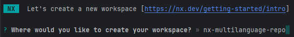

### Step 2

- choose a tech stack `React`

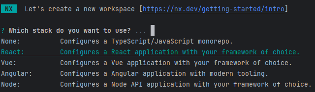

### Step 3

- choose a framework `None`

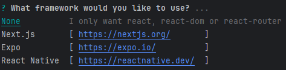

### Step 4

- choose an application name

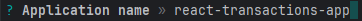

### Step 5

- decline using `React Router` for `SSR`

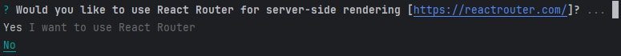

### Step 6

- select `Vite` as the bundler

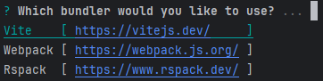

### Step 7

- select `Vitest` as the unit test runner

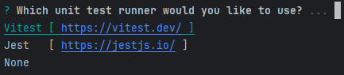

### Step 8

- select `Cypress` as the e2e test runner

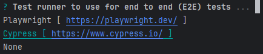

### Step 9

- select `CSS` as the default stylesheet

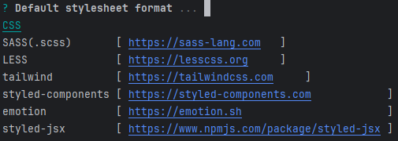

### Step 10

- use `Eslint`

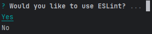

### Step 11

- use `Prettier`

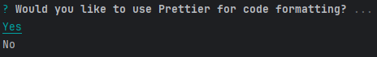

### Step 12

- select `GitHub Actions` as the CI provider

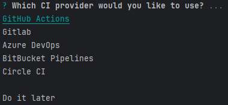

## Result

This is automatically create the `my-nx-workspace` and `my-nx-workspace-e2e` projects (apps) under the `apps` folder:

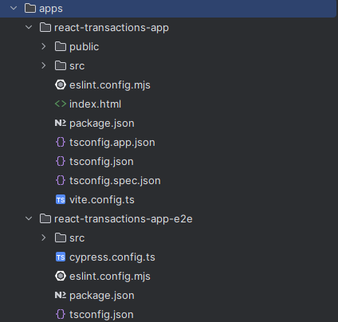

## Folder Structure

- in the workspace root create a `react` folder
- move the `apps` under the `react` folder
- rename the source root folder to `transactions-app` and `transactions-app-e2e`

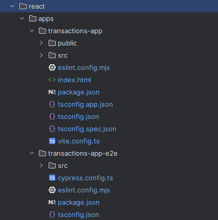

## Project Name

- change the `name` property in `package.json` to follow the project naming convention based in the [Project Conventions Docs](./tags-and-scopes.md)
- e.g. `react-transactions-app`, `react-transactions-app-e2e`
