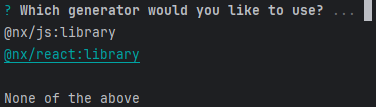
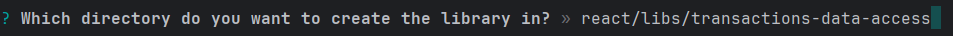
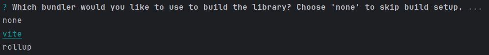
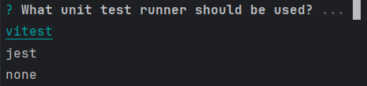
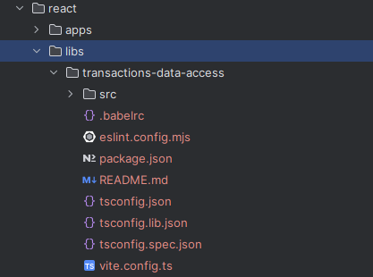

# Create React library

`$ npx nx g lib`

## Step 1
- choose the `@nx/react:libaray` generator

## Step 2
- choose the library source root (path from the workspace root)

## Step 3
- choose `vite` as a bundler

## Step 4
- choose `vitest` as a unit test runner

# Result

## Project Name
- change the `name` property in `package.json` to follow the project naming convention based in the [Project Conventions Docs](./tags-and-scopes.md) 
- change the `name` property of `lib` in the `vite.config.ts` file to follow the project naming convention
- e.g. `react-transactions-data-access`
