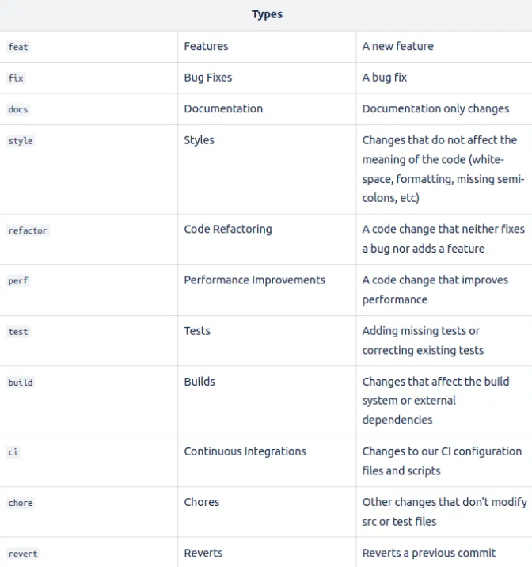

# Release and Publish Process in CI/CD

## Terminology

- `release` - is a preparation process including versioning and changelog generation before publishing
- `publish` - is the actual upload of projects' artifacts to a registry

## Release

- works with affected
- triggered on every merge to main (can be adjusted)
- uses [`@jscultery/semver`](https://www.npmjs.com/package/@jscutlery/semver) package to automatically orchestrate semantic versioning and changelog generation/updates based on the conventional commits
- creates a git tags and commits for released projects
- requires GITHUB_TOKEN secret to access the repository
- pushes the changes to the origin
- the CI configuration can be found in `.github/workflows/ci.yml`

### Conventional commits



## Publish

### NPM-based projects

- configured in `.github/workflows/npm-publish.yml`
- triggered by a tag push
- works with affected
- uses inferred `nx-release-publish` target
- requires `NPM_ACCESS_TOKEN` initialization (see step 2 below)

#### 1. Configure `package.json` with the Private Registry URL

- In your project's `package.json` file, you need to specify the private registry URL using the `publishConfig.registry` property
- e.g.

```json
{
  "name": "@my-org/my-library",
  "version": "1.0.0",
  "publishConfig": {
    "registry": "https://my-private-registry.example.com/npm/"
  }
}
```

or in `nx.json`'s `targetDefaults`:

```json
  "targetDefaults": {
    "nx-release-publish": {
      "options": {
        "registry": "https://my-private-registry.example.com/npm/"
      }
    },

```

#### 2. Configure authentication (if necessary)

- Private registries often require authentication. You can configure authentication using `.npmrc` files or environment variables
- Create or modify the .npmrc file in your project's root directory or in your user's home directory
- Add the authentication token or credentials for your private registry
- Example (for a basic token-based authentication):

```
//my-private-registry.example.com/npm/:_authToken=your-auth-token
```

### NuGet-based projects

- configured in `.github/workflows/nuget-publish.yml`
- triggered by a tag push
- works with affected
- uses inferred targets `pack` and `publish`
- requires `NUGET_API_KEY` initialization (see step 2 below)

#### 1. Configure the Private Registry URL

- In your project's `.github/workflows/nuget-publish.yml` file, you need to specify the private registry URL using `--source` cli argument
- see the code-snippet example below step 2

#### 2. Configure authentication (if necessary)

- Add the authentication token `NUGET_API_KEY` of your NuGet registry
- It will be picked up by the CI using `secrets.NUGET_API_KEY`

```yml
- name: Publish to NuGet
  run: npx nx affected --target=publish --args="--source https://api.nuget.org/v3/index.json --api-key ${{ secrets.NUGET_API_KEY }}"
```
